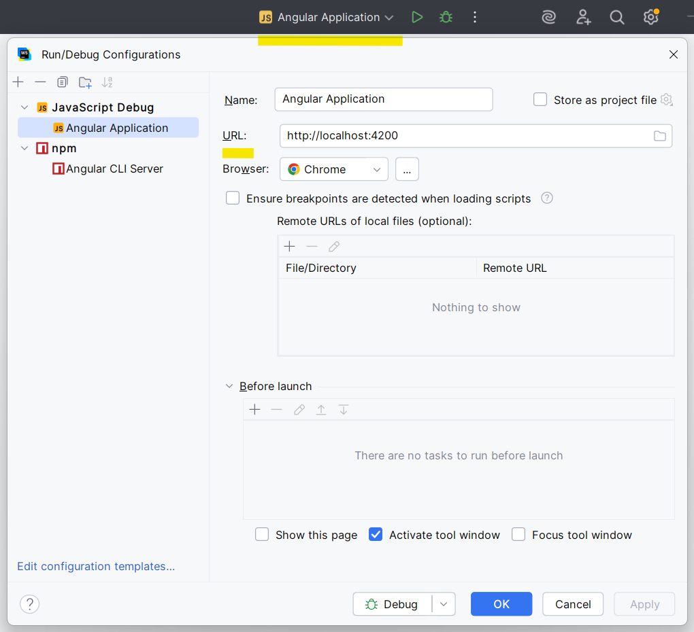
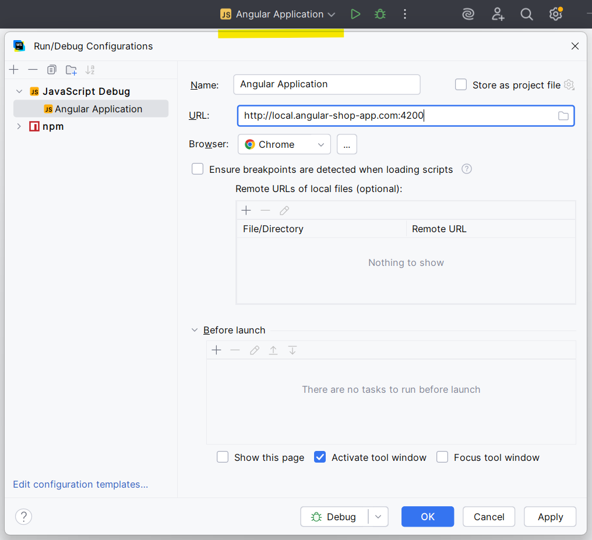

# Shop App with Angular 20

This project was generated using [Angular CLI](https://github.com/angular/angular-cli) version 20.0.5.

## Development server

- Start a local development server: `npm run start`     
  Once the server is running, open your browser and navigate to `http://localhost:4200/`. The application will automatically reload whenever you modify any of the source files.
- Run production build:
  `npm run build`
- Since SSR is enabled or this app, in order to test production build for different cases, use these instructions:
  - Test Server Side Rendering (SSR) or hybrid approach (SSR + SSG + csr)   
    `npm run serve:prod:ssr`
  - Test Static Side Rendering (SSG):   
    Install `serve` globally: `npm install -g serve` and use `serve:prod:ssg` command
  - Test Client Side Rendering (CSR):   
    Install `serve` globally: `npm install -g serve` and use `serve:prod:csr` command

## Debugging

Below are instructions how to debug this SSR enabled project which will work for all Angular SSR enabled projects, started from Angular 20 version.

### Webstorm
**1. Angular CLI Server (Client Side + Server Side Debugging)**  
When working with native Angular CLI, after opening the root of the project which is `angular-poc/apps/shop-app-ng-20` in our case,
there will be Angular CLI Server on the top part of your screen which you can use to debug `ng serve`. And hence it will also debug 
SSR server because `ng serve` handles both.

**2. Client-side Debugging**  
For only client-side debugging, there is another option which Angular creates for us. As we can see it has Javascript Debug type. 
Basically we attach a new browser debugging session for your running local url. So for this option you need firstly to run the project with `npm run start`
and only after that choose Angular Application and click debug icon. It will open a new Chrome debugging window for your running local project and will stop on debugging entry points.
This option gives as same value as putting breakpoints and debugging in the Chrome browser itself using Chrome dev tools.

  
### Cursor
For Cursor Angular CLI creates default configuration as well. However, the default configuration enables only client-side debugging and in order to leverage full SSR server + client-side debugging,
use the following configuration:

